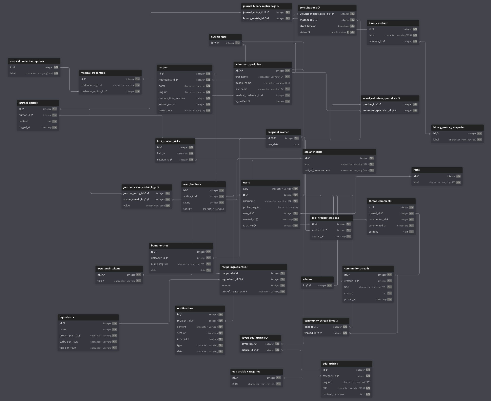
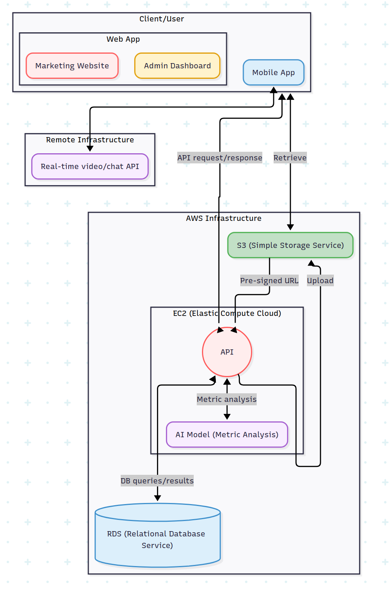

# MyPregnancy

A mobile application designed to support women throughout their pregnancy

---

## Quick start

#### Prerequisites

- [Node.js _(via nvm)_](https://nodejs.org/en/download)
  - Install the LTS: `nvm install --lts && nvm use --lts`
- [Docker](https://www.docker.com/)
- [Android Studio](https://developer.android.com/studio)
- [uv](https://docs.astral.sh/uv/)
  - Windows: ```powershell -ExecutionPolicy ByPass -c "irm https://astral.sh/uv/install.ps1 | iex"```
  - MacOS & Linux: ```curl -LsSf https://astral.sh/uv/install.sh | sh```

---

For these next steps, you will need two terminals - one for the frontend and one for the backend

#### Frontend

1. `cd frontend`
2. **[First time]**
    - Install dependencies: `npm i`
    - Create a copy of the `.env.example` and rename it to `.env`

3. Start:
   - Android emulator: `npm run android`
   - iOS _(MacOS only)_: `npm run ios`
   - Web: `npm run web`
4. Stop: `Ctrl-C`

#### Backend

1. `cd backend`
2. **[First Time]**
   - Create a Python virtual environment `uv venv .venv`
   - Activate the virtual environment
      - macOS and Linux: `source venv/bin/activate`
      - Windows: `venv\Scripts\Activate.bat`
   - Install dependencies: `uv sync`
   - Create a copy of the `.env.example` and rename it to `.env`
3. Building for first time? `docker compose up --build`. Otherwise, just `docker compose up`
4. `docker compose down` to stop the running container(s)

---

## Workflow

#### Database Migrations

_(this assume the 'backend' directory as the root)_
Currently, schemas are all defined within `./app/db/db_schema.py`

1. Whenever you modify a schema, generate a new migration
   `alembic revision --autogenerate -m "<YOUR SAVE MESSAGE>"`
2. Immediately apply your newly-generated migrations
   `alembic upgrade head`

#### Managing Python Dependencies

_If you ever need to install or uninstall a new Python package during development, make sure that you first activate your virtual environment_

* Adding packages: `uv add <MY_PACKAGE>`
* Removing packages: `uv remove <MY_PACKAGE>`
* Sync up with lockfile: `uv sync`

#### Testing

Simply run `pytest`
That's it.

### Managing LocalStack
Will can manage your LocalStack resources through the web console [here](https://app.localstack.cloud/inst/default/status) _(will require a free account)_

---

## Database Schema (Updated 16-Nov-25)



## Service Architecture (Updated 16-Nov-25)


